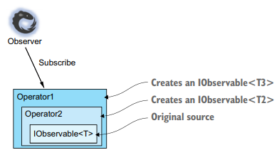
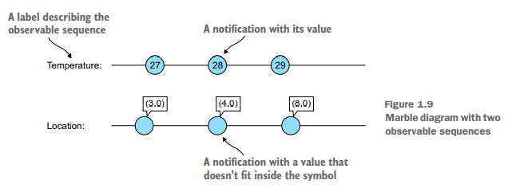
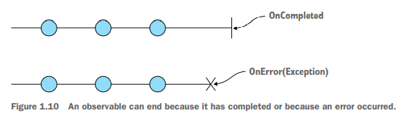
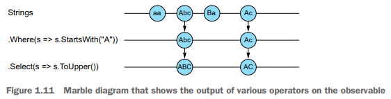
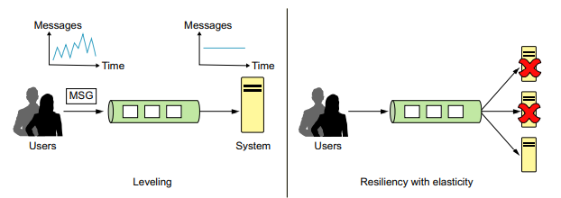
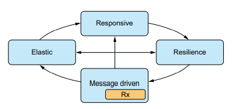
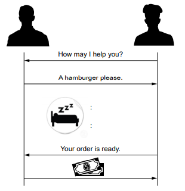

# 响应式编程

**本章涵盖**

- 开始响应式
- 将事件（events）看做流（streams）
- Reactive Extensions (Rx) 简介

近年来，响应式编程范式作为一种旨在简化事件驱动应用程序的实现和异步代码执行的模型，越来越受欢迎。 响应式编程专注于变化的传播及其影响——简而言之，如何对变化做出响应并创建依赖于它们的数据流。

随着诸如 Facebook 和 Twitter 之类的应用程序的兴起，在海洋的一侧发生的每一个变化（例如，状态更新）都会立即在彼岸被观察到，并且应用程序内部会立即发生一系列反应。 需要一个简化的模型来表达这个反应链，这不足为奇。 如今，现代化的应用受到外部环境变化（例如GPS位置，电池和电源管理以及社交网络消息）以及应用内部变化（例如 Web 电话响应，文件读写，计时器）。对于这些事件，应用程序都做出了相应的反应，例如，更改显示的视图或修改存储的数据。

我们看到了在许多类型的应用程序中，对事件做出反应的简单模型的必要性：机器人技术，移动应用程序，医疗保健等。以经典的命令性方式对事件做出反应会导致代码繁琐，难以理解且容易出错，可怜的程序员做一些修改时，不可避免地影响别的逻辑。这些更改可能会以不可预测的顺序发生，甚至可能同时发生。响应式编程为事件和随时间变化的状态提供了抽象，以便我们创建在事件发生时运行的执行链时，我们可以摆脱管理这些值之间的依赖关系的麻烦。

Reactive Extensions（Rx）是一个库，为 .NET 应用程序提供了响应式编程模型。 Rx 通过使用声明性操作（采用 LINQ 样式）在单个事件序列上创建查询，使事件处理代码更简单，更具表现力。Rx还提供了称为组合器（组合操作）的方法，这些方法使您能够加入事件序列，以便处理事件发生的模式或事件之间的相关性。 在撰写本文时，Rx 库中有600多个操作（算上重载方法）。 每个代码都封装了重复发生的事件处理代码，否则您将不得不编写自己的代码。

本书的目的是教您为什么应该使用响应式编程的思维方式，以及如何轻松使用 Rx，最主要的是愉悦的来构建基于事件驱动的应用程序。 这本书将一步一步教你关于 Rx 构建的各个层面，通过搭积木的方式允许你创建响应式的数据和事件流，通过 Rx 提供的丰富查询功能，以及 Rx 并发模型，允许您控制代码的异步性和响应式处理程序的处理。 但首先您需要了解响应式意味着什么，以及传统命令式编程和处理事件的方式与响应式之间的区别。 

## 1.1 开始响应式

当应用程序发生更改时，您的代码需要对此做出反应；这就是响应式的意思。变化有多种形式，最简单的形式就是更改在编程中常见的变量值。该变量包含一个值，该值可以在特定时间通过某个操作进行更改。例如，在 C# 中，您可以编写如下代码：

```cs
int a = 2;
int b = 3;
int c = a + b;
Console.WriteLine("before: the value of c is {0}", c);
a=7;
b=2;
Console.WriteLine("after: the value of c is {0}", c);
```

输出：

```
before: the value of c is 5
after: the value of c is 5
```

在这个程序中，两个打印输 c 变量显示相同的值。 在命令式编程模型中，c 的值为 5，除非您显式地为它赋值，否则它将保持为 5。

有时您希望在 a 或 b 更改时更新 c。 响应式编程引入了随时间变化的另一种类型的变量：该变量并不是固定的值，而是随时间变化而做出响应，继而改变。

再看一下我们的小程序； 在响应式编程模型中运行时，输出为：

```
before: the value of c is 5
after: the value of c is 9
```

“神奇”地改变了 c 的值。 这是由于其依赖项发生了更改。 此过程的工作原理就像一台机器由两个平行的输送机供料，并从任一侧的输入生成物品一样，如图 1.1 所示。


_函数 `c = a + b` 的响应式表示。 随着 a 和 b 的值变化，c 的值也变化。 当 a 为 7 且 b 为 2 时，c 自动更改为 9。当 b 更改为 1 时，c 变为 8，因为 a 的值仍为 7。_

您可能会感到惊讶，但是您可能已经使用了响应式应用程序多年。响应式的概念使您最喜欢的电子表格应用程序变得如此易于使用和有趣。当您在电子表格单元格中创建此类方程式时，每次更改输入方程式的单元格中的值时，最终单元格会自动更改。

### 1.1.1 在应用程序中的响应性

在实际的应用程序中，您会发现在许多情况下都有随时变化的变量，例如 GPS 位置，温度，鼠标坐标，甚至是文本框内容。这些值都具有随时间变化的特性，应用程序会对这些值做出响应，因此它们是随时间变化的。还值得一提的是时间本身是一个时变；它的值一直在变化。在 C# 这样的命令式编程模型中，您可以使用事件（event）来对变化做出响应，但是由于事件分散在各个代码片段中，因此可能导致代码难以维护。

想象一下一个移动应用程序，它可以帮助用户在其周边地区的商店中找到折扣和特价。我们称之为 Shoppy。 图1.2描述了 Shoppy 架构。


_图 1.2 Shoppy 应用程序体系结构。移动应用程序从 GPS 接收当前位置，并可以通过应用程序的服务查询有关商店和交易的信息。当有新交易可用时，应用程序的服务通过推送服务发送通知。_

您想从 Shoppy 获得的一个很棒的功能之一就是，随着用户距离（从某个最小半径开始）越来越近，使商店图标的大小在地图上变大，如图 1.3 所示。 您还希望系统在更新时将新交易推送到应用程序可用。


_图 1.3 Shoppy 应用程序的地图视图。当用户离 Rx 商店很远时，图标变小（在左侧），而当用户靠近时，图标变大（在右侧）。_

在这种情况下，您可以说 `store.Location`， `myLocation` 和 `iconSize` 变量是时变的。 对于每个商店，图标大小可以写成：

```cs
distance = store.Location – myLocation;
iconSize = (MINIMAL_RADIUS / distance) * MinIconSize
```

由于您使用的是时变变量，因此每次 `myLocation` 变量发生变化时，距离变量都会触发变化。 最终，应用程序将通过使商店图标显得更大或更小做出反应，具体取决于用户与商店的距离。 请注意，为简单起见，我没有处理允许的最小图标尺寸的边界检查，该距离可能为 0 或接近它。

这是一个简单的示例，但是正如您看到的那样，使用响应式编程模型的强大功能在于其合并和联接，以及对每个时变量所推的值作为流进行分区和分割的能力。这是因为响应式编程使您可以专注于要实现的目标，而不是其工作的技术细节。使得代码简单易读，并且消除了大多数样板代码（例如更改跟踪或状态管理），这些代码会使您从代码逻辑的意图中分离。当代码简短而集中时，它的 bug 更少，更易于掌握。

现在，我们可以从理论上停止讨论，付诸实践，以便您可以了解如何在 .NET 中进行响应式编程。

## 1.2 Reactive Extensions 介绍

既然我们已经介绍了响应式编程，那么现在是时候了解我们的新星了：Reactive Extensions，通常简称为 Rx。Microsoft 开发了 Reactive Extensions 库，以使其易于处理事件和数据流。从某种意义上说，时变值本身就是事件流。每次值的更改，都会触发您订阅的事件。

Rx 通过将事件流抽象为可观察序列来促进处理事件流，这也是 Rx 表示时变值的方式。 Observable 意味着您作为用户可以观察序列携带的值，而序列意味着对携带的内容存在顺序。 Rx 由 Erik Meijer 和 Brian Beckman 设计，并从函数式编程风格中汲取灵感。 在 Rx 中，Observable 表示流，您可以从 .NET event、Task 或 集合创建，也可以自己从其他来源创建。 使用 Rx，您可以使用 LINQ 操作符查询 Observables 并使用调度程序控制并发； 这就是为什么 Rx 在 Rx.NET 源中经常被定义为 Rx = Observables + LINQ + Schedulers. Rx.NET 的分层如图 1.4 所示。


_图 1.4 Rx 分层。 中间是代表事件流的关键接口，最下面是控制流处理的并发性的调度程序。最重要的是强大的运算符库，使您可以创建 LINQ 风格的事件处理管道。_

在本书中，您将探索 Rx 图层的每个组成部分以及它们之间的相互作用，但是首先让我们看一下 Rx 起源的简短历史。

### 1.2.1 Rx 的历史

我认为，要完全控制某些东西（尤其是技术），您应该了解历史和幕后的细节。让我们从带有电鳗的Rx徽标开始，如图 1.5 所示；这条鳗鱼是Microsoft Live Labs 的 Volta 项目徽标。


_图 1.5 Rx 电鳗 logo，灵感来自 Volta 项目_

Volta 项目是一个实验性开发人员工具集，用于在正式定义云这个术语之前为云创建多层应用程序。 使用 Volta，您可以指定应用程序的哪些部分需要在云（服务器）中运行，哪些部分需要在客户端（桌面，JavaScript 或 Silverlight ）运行，而 Volta 编译器将为您完成艰苦的工作。 很快，很明显在将服务器产生的事件传输到客户端方面存在差距。由于 .NET 事件不是一等公民，因此无法序列化并推送给客户端，因此形成了可观察者和观察者对（尽管当时并没有这样）。

Rx 并不是 Volta 项目中唯一的技术。 还发明了JavaScript 编译器的中间语言（IL），它是Microsoft TypeScript 的起源。 在 Volta 上工作的同一支团队就是将 Rx 变为现实的一支。

自 2010 年发布以来，Rx 就是一个成功的故事，已被许多公司采用。在 .NET 之外的其他社区中也看到了它的成功，并且很快将其移植到其他语言和技术中。例如，Netflix 在其服务层中广泛使用 Rx，并负责 RxJava 端口。微软还内部使用 Rx 来运行 Cortana，Cortana 是每台 Windows Phone 设备中托管的智能个人助手；创建事件时，将在后台创建一个可观察对象。

在撰写本文时，Rx 支持 10 多种语言，包括 JavaScript，C++，Python 和 Swift。 Reactive Extensions 现在是开放源代码项目的集合。 您可以在 http://reactivex.io/ 上找到有关它们的信息以及文档和新闻。.NET的 Reactive Extensions 托管在GitHub存储库中，网址为 https://github.com/Reactive-Extensions/Rx.NET 。

现在，我们已经介绍了一些历史并有幸来讲述了这一点，让我们开始探索 Rx 的内部。

### 1.2.2 Rx 在客户端和服务端

Rx 非常适合事件驱动的应用程序。这是有道理的，因为事件（如前所述）是创建时变值的必要方法。从历史上看，由于用户交互被实现为事件，因此事件驱动的编程主要出现在客户端技术中。例如，您可能使用过 OnMouseMove 或 OnKeyPressed 事件。因此，您会发现许多使用Rx的客户端应用程序也就不足为奇了。此外，某些客户端框架基于 Rx，例如 ReactiveUI（[http://reactiveui.net](http://reactiveui.net)）。

但是，请允许我向您保证，Rx 不是仅客户端技术。相反，对于 Rx 完全适合的服务器端代码，存在许多方案。此外，正如我之前所说，Rx 用于大型应用程序，例如 Microsoft Cortana，Netflix 和 Microsoft StreamInsight。 Rx 是一个出色的库，用于处理应用程序收到的消息，无论它是在服务层还是客户端层上运行都无关紧要。

### 1.2.3 Observables

可观察（Observables）变量用于在Rx中实现时变值（我们将其定义为可观察序列）。它们代表推送模型（push model），在该模型中，新数据被推送（或通知）到观察者。

Observables 被定义为事件（或通知）的来源，或者，如果您愿意，可以定义为数据流的发布者。 推模型意味着，不是让观察者从源获取数据并始终检查是否有新数据尚未被采用（pull model），而是在数据可用时将数据交付给观察者。

自 .NET Framework 4.0 版以来，可观察对象实现了 `IObservable<T>` 接口，该接口已驻留在System 命名空间中。

**清单 1.1** IObservable 接口

```cs
public interface IObservable<T>
{
    // 让观察者订阅可观察的序列
    IDisposable Subscribe(IObserver<T> observer); 
}
```

`IObservable<T>` 接口只有一个方法“Subscribe”，该方法允许观察者订阅通知。 Subscribe 方法返回一个 IDisposable 对象，该对象表示预订，并允许观察者随时通过调用 Dispose 方法取消预订。 可观察者持有已订阅观察者的集合，并在有必要通知时通知他们。这是使用 `IObserver<T>` 接口完成的，该接口从 .NET Framework 4.0 版开始也位于 System 命名空间中，如此处所示。

**清单 1.2** IObserver 接口

```cs
public interface IObserver<T>
{
    // 以可观察的顺序通知观察者一个新元素
    void OnNext(T value);
    // 通知观察者发生异常
    void OnError(Exception error);
    // 通知观察者可观察的序列已完成，不再发出任何通知。
    void OnCompleted();
}
```

使用 IObservable 和 IObserver 的基本流程如图 1.6 所示。 可观察的数据并不总是完整的； 它们可以是可能无限数量的已排序元素（例如，无限集合）的提供者。 可观察对象也可以是“安静的”，这意味着它永远不会推动任何元素，将来也不会。 观察者也可能失败； 失败可能发生在可观察对象已经推送元素之后，也可能发生在没有推送任何元素的情况下。

该可观测代数在以下表达式中正式化（其中 `*` 表示零次或多次，`?` 表示零次或一次，`|` 是 OR 运算符）

```math
OnNext(t)* (OnCompleted() | OnError(e))?
```


_图 1.6 交互的可观察和观察者流的 happy path 的顺序图。 在这种情况下，观察者被应用程序订阅了可观察者。 观察者将三则消息“推送”给观察者（在这种情况下只有一个），然后通知观察者消息已完成。_

失败时，将使用 OnError 方法通知观察者，并将异常对象传递给观察者以进行检查和处理（参见图 1.7 ）。 在发生错误之后（以及完成之后），不会再有更多消息发送给观察者。 当观察者不提供错误处理程序时，Rx 使用的默认策略是上报异常并导致崩溃。 您将在第 10 章中了解如何妥善处理错误的方法。


_图 1.7 观察到错误，将通过OnError方法将失败的异常对象通知给观察者。_


> **观察者设计模式**
>
> 在某些编程语言中，事件有时以一等公民的身份提供，这意味着您可以使用语言提供的关键字和类型定义和注册事件，甚至可以将事件作为参数传递给函数。
>
> 对于不支持事件作为一等公民的语言，观察者模式是一种有用的设计模式，可让您向应用程序添加类似事件的支持。 此外，.NET 的事件实现基于此模式。
>
> 观察者模式由“四人帮”（GoF）在“Design Patterns: Elements of Reusable Object-Oriented Software ”（Addison-Wesley Professional，1994）中引入。 该模式定义了两个部分：主题和观察者（不要与 Rx 的 IObserver 混淆）。 观察者是对事件感兴趣的参与者，并订阅引发事件的主题。 这是在统一建模语言（UML）类图：
>
> 

观察者模式很有用，但存在一些问题。 观察者只有一种方法可以接受事件。 如果要附加到一个以上的主题或一个以上的事件，则需要实现更多的更新方法。 另一个问题是，模式没有指定处理错误的最佳方法，而开发人员则需要找到一种方法来通知错误（如果有的话）。 最后但并非最不重要的一点是如何知道何时完成主题的问题，这意味着将不再有通知，这对于正确的资源管理可能至关重要。 Rx IObservable 和 IObserver 基于观察者设计模式，但对其进行了扩展以解决这些缺点。

### 1.2.4 Operators 操作符

Rx 还带来了一组丰富的操作符。 在 Rx 中，操作符是一种很好的表示操作的方式，但除此之外，它也是领域特定语言 (DSL) 的一部分，以声明方式描述事件处理。 Rx 运算符允许您获取 Observables 和 Observers 并创建查询、转换、投影和您可能从 LINQ 中知道的其他事件处理器的管道。 Rx 库还包括基于时间的操作和特定于 Rx 的操作，用于查询、同步、错误处理等。

例如，这是您订阅一个可观察的字符串序列，该序列将仅显示以 A 开头的字符串并将它们转换为大写：

```cs
IObservable<string> strings = ... // 可观察的字符串，将被推送给观察者

IDisposable subscription = strings // 保存订阅使您可以在以后取消订阅
    .Where(str => str.StartWith("A")) // 只允许以 A 开头的字符串传递给观察者
    .Select(str => str.ToUpper()) // 字符串被转换为大写
    .Subscribe(...); // 观察者接收通过滤器和转换后的字符串

// ...

subscription.Dispose(); // 当您不在想接收字符串时取消订阅
```

**注意：** 如果您不了解每个关键字的所有语法或含义，请不要害怕。 我将在接下来的章节中解释这些。

在这个简单的例子中，你可以看到 Rx 操作符的声明式风格——说你想说而不是你想怎么说——所以代码读起来就像一个故事。因为我想在这个例子中关注查询操作符，所以我没有展示 Observable 是如何创建的。您可以通过多种方式创建 Observable：从事件、迭代器、异步类型等。这些将在第 4 章和第 5 章中讨论。现在，您可以假设 Observable 是在幕后为您创建的。

运算符和组合器（组合多个 Observable 的运算符）可以帮助您创建涉及多个 Observable 的更复杂的场景。要在 Shoppy 示例中实现可调整大小的商店图标，您可以编写以下 Rx 表达式：

```cs
IObservable<Store> stores = ...;
IObservable<Location> myLocation = ...;
IObservable<StoreIconSize> iconSize = 
    from store in stores
    from currentLocation in myLocation
    let distance = store.Location.DistanceFrom(currentLocation)
    let size = (MINIMAL_RADIUS / distance) * MIN_ICON_SIZE
    select new StoreIconSize { Store = store, Size = size };

// lambda 表达式充当观察者的 OnNext 实现，每次商店图标具有新大小时都会被调用。
iconSize.Subscribe(iconInfo => iconInfo.Store.Icon = iconInfo.Size);
```

即使不了解 Reactive Extensions 的所有细节，您也可以看到在 Shoppy 应用程序中实现此功能所需的代码量很少，并且易于阅读。 组合各种数据流的所有样板都是由 Rx 完成的，并为您减轻了负担，您不需要编写数据更改事件所需的隔离代码，一切交给 Rx.

### 1.2.5 Rx 操作符的可组合性

大多数 Rx 运算符具有以下格式：

```cs
IObservable<T> OperatorName(arguments)
```



_Rx 操作符的可组合特性允许您封装通知发生的情况，因为它是从原始源发出的。_

请注意，返回类型是可观察的。 这允许 Rx 操作符的可组合特性； 您可以向 Observable 管道添加操作符，每个操作符都会生成一个 Observable，它封装了从通知从原始源发出的那一刻起应用于通知的行为。

另一个重要的收获是，从观察者的角度来看，添加或不添加操作符的 Observable 仍然是一个 Observable，如图 1.8 所示

因为您不仅可以在创建 Observable 时向管道添加运算符，还可以在订阅观察者时将运算符添加到管道中，所以即使您无法访问创建它的代码，它也赋予您控制 Observable 的权力。

### 1.2.6 弹珠图

一张图片胜过千言万语。这就是为什么在解释反应式编程和 Rx 时，展示可观察序列的执行管道很重要。 在本书中，我使用弹珠图图来帮助您了解操作及其关系。

弹珠石图使用水平轴来表示可观察序列。 Observable 上携带的每个通知都标有一个符号，通常是一个圆圈（尽管有时会使用其他符号），以区分值。 通知的值写在符号内或作为其上方的注释，如图 1.9 所示。



在弹珠图中，时间从左到右，符号之间的距离表示两个事件之间经过的时间量。距离越长，时间越长，但只是相对的。 无法知道时间是以秒、小时还是其他计量单位。如果此信息很重要，则会将其写为注释。

要显示 Observable 已完成，您可以使用 `|` 表示。 为了表明发生了错误（也结束了可观察对象），您可以使用 `X`。图 1.10 显示了示例。



要在 Observable 上显示一个操作符（或多个操作符）的输出，您可以使用一个箭头来指示源事件和结果之间的关系。请记住，每个运算符（至少是绝大多数运算符）都返回其自己的可观察量，因此在图中，我在左侧写的操作符是管道的一部分，在右侧写的行代表从管道返回的可观察对象。图 1.11 显示了前一个可观察字符串序列示例的弹珠图，该示例仅显示以 A 开头的字符串并将它们转换为大写。



本书使用弹珠图来显示运算符的效果以及组合运算符以创建可观察管道的示例。此时，您可能想知道可观察序列与不可观察序列之间的关系。答案在后面。

### 1.2.7 Pull 模型 vs Push 模型

不可观察序列就是我们通常所说的可枚举（Enumerables）（或集合），它实现了 IEnumerable 接口并返回一个实现了 IEnumerator 接口的迭代器。使用枚举（Enumerables）时，通常使用循环从集合中拉取（Pull）值。 Rx Observables 的行为不同：不是 Pull，而是将值 Push 给观察者。 表 1.1 和 1.2 显示了 Pull 模型和 Push 模型如何相互对应。两者之间的这种关系称为对偶原理。

表 1.1 IEnumerator 和 IObserver

| IEnumerator | IObserver |
| :- | :- |
| MoveNext - when false | OnCompleted |
| MoveNext - when exception | OnError(Exception exception) |
| Current | OnNext(T) |

表 1.2 Ienumerbale 和 IObservable

| Ienumerbale | IObservable |
| :- | :- |
| IEnumerator GetEnumerator(void) | IDisposable Subscribe(IObserver) |

可观察者和观察者填补了 .NET 在处理异步操作时的空白，该操作需要在 Push 模型中返回一系列值（推送序列中的每个项目）。 与异步提供单个值的 Task<T> 或提供多个值但在同步 Pull 模型中的 IEnumerable 不同，可观察对象异步发出一系列值。 这在表 1.3 中进行了总结。

表 1.3 Push 模型和 Pulll 模型数据类型

|  | 单个值 | 多个值 |
| :- | :- | :- |
| Pull/同步/交互式 | T | IEnumerable<T> |
| Push/异步/响应式 | Task<T> | IObservable<T> |

因为可观察对象和可枚举对象之间存在反向对应关系（二元性），所以您可以从值序列的一种表示转移到另一种表示。 一个固定的集合，比如 List<T>，可以转换成一个 Observable，通过将它们推送给观察者来发射它的所有值。 更令人惊讶的事实是 Observables 可以转换为基于 Pull 的集合。 您将在后面的章节中深入了解到如何以及何时进行这些转换的细节。现在，要理解的重要一点是，因为您可以将一个模型转换为另一个模型，所以您可以使用基于 Pull 模型执行的所有操作也可以使用基于 Push 模型来完成。 所以当你遇到问题时，你可以用最简单的模型解决它，然后根据需要转换结果。

我在这里要说的最后一点是，因为您可以将单个值视为集合中的一个 item，所以您可以按照相同的逻辑将异步单个 item `Task<T>` 视为可观察对象的一个 item，反之亦然。记住这一点，因为这是理解“一切都是可观察的”的重要一点。

## 1.3 使用响应式系统和响应式宣言

到目前为止，我们已经讨论了 Rx 如何为应用程序增加响应性。许多应用程序不是独立的，而是整个系统的一部分，该系统由更多应用程序（桌面、移动、Web）、服务器、数据库、队列、服务总线和您需要连接以创建的其他组件组成一个工作的有机体。响应式编程模型（以及 Rx 作为该模型的实现）简化了应用程序处理更改传播和事件消费的方式，从而使应用程序具有响应性。但是如何才能使整个系统具有响应性呢？

作为一个系统，反应性被定义为响应性（Responsive）、韧性（Resilient）、弹性（Elastic）和消息驱动（Message Driven）。 响应式宣言(www.reactivemanifesto.org)中定义了反应式系统的这四个特征，这是软件社区的一项协作努力，旨在定义构建反应式系统的最佳架构风格。你可以通过签署宣言和传播信息来提高人们对反应系统的认识。

重要的是要了解响应式宣言并没有发明任何新东西。响应式应用程序早在宣言发布之前就已经存在。一个例子是已经存在了几十年的电话系统。这种类型的分布式系统需要对动态负载（调用）做出反应，从故障中恢复，并保持可用，并 24/7 全天候响应调用者和被调用者，而这一切都是通过从一个操作员对另一个操作员传递信号（消息）来实现的。

宣言在这里将反应式系统术语放在路线图上，并收集创建此类系统的最佳实践。让我们深入研究这些概念。

### 1.3.1 响应能力（Responsiveness）

当您在浏览器输入 URL 时，您希望浏览的页面会在短时间内加载。当加载时间超过几毫秒时，你会有一种不好的感觉（甚至可能会生气）。您可能决定离开该站点并浏览到另一个站点。如果您是网站所有者，您已经失去了一位客户，因为您的网站没有响应。

系统的响应能力取决于收到请求所需的时间。显然，更短的响应时间意味着系统响应更快。来自系统的响应可能是积极的结果，例如您尝试加载的页面，或者您尝试从 Web 服务获取的数据，再或者您希望在金融客户端应用程序中查看的图表。响应也可以是否定的，例如指定您作为输入方提供的值之一无效的错误消息。

在任何一种情况下，如果系统响应所需的时间是合理的，您就可以说应用程序是响应的。但是定义一个合理的时间是一个有问题的事情，因为它取决于上下文和你正在测量的系统。对于具有按钮的客户端应用程序，假设应用程序响应按钮单击所需的时间为几毫秒。对于需要进行大量计算的 Web 服务，一两秒也可能是合理的。在设计应用程序时，您需要分析您拥有的操作并定义操作完成和响应所需的时间范围。 响应式（Responsive）是反应式（Reactive）系统试图实现的目标。

### 1.3.2 韧性（Resilient）

每隔一段时间，您的系统可能会遇到故障。网络断开、硬盘驱动器故障、停电或内部组件出现异常情况。韧性系统是在发生故障时保持响应的系统。换句话说，当您编写应用程序时，您希望以不阻止用户获得响应的方式处理故障。

为应用程序添加韧性的方式因应用程序而异。一个应用程序可能会捕获异常并将应用程序返回到一致状态。另一个应用程序可能会添加更多服务器，以便如果一个服务器崩溃，另一个将补偿和处理请求。为了提高系统的韧性，您应该遵循的一个好原则是避免单点故障。这可以通过使应用程序的每个部分与其他部分隔离来实现；您可以将部分分成不同的 AppDomain、不同的进程、不同的容器或不同的机器。通过隔离部件，您可以降低系统整体不可用的风险。

### 1.3.3 弹性（Elastic）

您正在编写的应用程序将被大量用户使用（希望是大量用户）。每个用户都会向您的系统发出请求，这可能会导致您的系统需要处理高负载。系统中的每个组件对它可以处理的负载级别都有限制，当负载超过该限制时，请求将开始失败，组件本身可能会崩溃。这种负载增加的情况也可能是由您的系统遇到的分布式拒绝服务 (DDoS) 攻击引起的。

为了解决过载的原因，您的系统需要具有弹性：它需要在负载高增加实例，并在负载减少时移除实例。 自从云进入我们的生活以来，这种自动行为变得更加明显。在云端运行时，你会得到资源无限的错觉；通过一些简单的配置，您可以将应用程序设置为向上或向下扩展，具体取决于您定义的阈值。 您只需要记住支付额外运行的服务器相关的成本。

### 1.3.4 消息驱动（Message Driven）

在这一点上，您可以说响应能力是您的目标，韧性是确保您保持响应的方式，而弹性是保持韧性的一种方法。反应式系统缺失部分是系统各部分相互通信的方式，以允许我们探索的反应性类型。

异步消息传递是最适合我们需求的通信过程，因为它允许我们在不限制生产者的情况下控制每个组件的负载级别——通常使用中间通道，例如队列或服务总线。 它允许将消息路由到正确的目的地，并在组件崩溃时重新发送失败的消息。 它还增加了内部系统组件的透明度，因为除了它可以处理的消息类型之外，用户不需要知道内部系统结构。消息驱动使所有其他反应性概念成为可能。 图 1.12 显示了使用消息队列的消息驱动方法，如何帮助平衡系统中的消息处理速率并实现韧性和弹性。



_图 1.12 消息驱动方法对负载均衡和弹性的关系。在左侧，消息以高频率到达，但系统处理被调整为恒定速率，并且队列填充速度快于排空速度。在右边，即使处理工作者角色崩溃了，用户仍然可以填满队列；当系统恢复并添加新的工作人员时，继续处理。_

在图中，参与者通过消息队列以消息驱动的方式进行通信。客户端发送一条消息，稍后由服务器检索。这种异步通信模型可以更好地控制系统中的处理——控制速率和处理故障。存在许多消息队列实现，具有不同的功能集。有些允许消息的持久性，从而提供持久性，有些还提供“事务”传递模式，锁定消息直到消费者发出处理成功完成的信号。无论您选择哪个消息队列（或消息驱动平台），您都需要以某种方式获取已发送的消息并开始处理它们。这就是 Rx 适合的地方。

### 1.3.5 Rx 在哪里？

Reactive Extensions 库在组成反应式系统的应用程序中发挥作用，它与消息驱动的概念有关。Rx 不是在应用程序或服务器之间移动消息的机制，而是负责在消息到达时处理消息并将它们沿应用程序内部的执行链传递的机制。 重要的是要说明使用 Rx 是您可以做的事情，即使您没有开发具有许多组件的完整系统。 即使是单个应用程序也可以发现 Rx 对响应事件和应用程序可能想要处理的消息类型很有用。 所有 Reactive Manifesto 概念和 Rx 之间的关系如图 1.13 所示。



_图 1.13 响应式宣言核心概念之间的关系。Rx 被定位在消息驱动的概念中，因为 Rx 提供了在消息进入应用程序时对其进行处理的抽象_

为了得到一个完全反应式的系统，图中的所有概念都必须存在。每一种都可以在不同的系统中以不同的方式实现。Rx 是一种允许更轻松地使用消息的方法，因此它显示为消息驱动块的一部分。Rx 被引入作为处理异步和基于事件的程序的一种方式，就像在消息例子一样，所以我解释异步意味着什么，以及为什么它很重要很重要。

## 1.4 理解异步性

异步消息传递是反应式系统的一个关键特性。但究竟什么是异步性，为什么它对反应式应用程序如此重要？我们的生活由许多异步任务组成。您可能没有意识到这一点，但如果它们本质上不是异步的，那么您的日常活动就会很烦人。要了解异步慢性化是什么，您首先需要了解非异步执行或同步执行。

**定义** 同步：恰好同时发生、存在或出现。

同步执行意味着你必须等待一个任务完成才能继续下一个任务。一个真实的同步执行例子发生在一家快餐店：你在柜台找到工作人员，在店员等待的时候决定点什么，下单你的食物，直到饭菜准备好。店员会等到你交完钱，然后给你食物。只有这样你才能继续下一个任务，去你的桌子吃饭。 这个序列如图 1.14 所示。



这种类型的序列感觉像是在浪费时间（更确切地说，是在浪费资源），所以想象一下当你为它们做同样的事情时你的应用程序的感受。 下一节将演示这一点。

### 1.4.1 一切都与资源使用有关

想象一下，如果你必须等待每一个操作完成才能做其他事情，你的生活会是什么样子。 想象一下当使用资源时需要等待。同样的问题也与计算机科学相关：

```cs
writeResult = LongDiskWrite();
response = LongWebRequest();
entities = LongDatabaseQuery();
```

在这个同步代码片段中，LongDatabaseQuery 在 LongWebRequest 和 LongDiskWrite 完成之前不会开始执行。 在每个方法执行期间，调用线程被阻塞，它持有的资源实际上被浪费了，不能用于服务其他请求或处理其他事情。如果这发生在 UI 线程上，应用程序将看起来冻结，直到执行完成。如果这发生在服务器应用程序上，那么在某些时候您可能会用完空闲线程并且请求将开始被拒绝。在这两种情况下，应用程序是停止响应的。

运行上述代码片段所需的总时间如下：

```
total_time = LongDiskWrite()_Time + LongWebRequest()_Time + LongDatabaseQuery()_Time
```

总完成时间是其组成部分的完成时间之和。如果您可以在不等待前一个操作完成的情况下开始一个操作，您就可以更好地利用您的资源。这就是异步执行的目的。

异步执行意味着一个操作开始了，但它的执行发生在后台并且调用者没有被阻塞。而是在操作完成时通知调用者。在那个时候，调用者可以继续做有用的工作。

在食品订购示例中，异步方法类似于坐在餐桌旁由服务员服务。 首先，您坐在餐桌旁，服务员过来递给您菜单并离开。当您决定点什么时，服务员仍然可供其他顾客使用。当你决定好要吃的食物后，
服务员回来接受您的订单。在准备食物时，您可以自由聊天、使用手机或欣赏美景。您没有被阻止（服务员也没有被阻止）。食物准备好后，服务员会将其带到您的餐桌上，然后返回为其他顾客服务，直到您要求结帐并付款为止。

该模型是异步的：任务并发执行，执行时间与请求时间不同。这样，资源（例如服务员）就可以自由地处理更多的请求。

---

**异步执行在哪里发生？**

在计算机程序中，我们可以区分两种类型的异步操作：基于 CPU 的和基于 I/O 的。

在基于 CPU 的操作中，异步代码运行在另一个线程上，并在另一个线程上的执行完成时返回结果。

在基于 I/O 的操作中，操作是在 I/O 设备（例如硬盘驱动器或网络）上进行的。 在网络上，向另一台机器发出请求（通过使用 TCP 或 UDP 或其他网络协议），当您机器上的操作系统通过中断从网络硬件获得结果返回的信号时，则操作将完成。

在这两种情况下，调用线程都可以自由地执行其他任务并处理其他请求和事件。

---

异步运行代码的方法不止一种，这取决于所使用的语言。 附录 A 展示了在 C# 中实现这一点的方法，并深入探讨了每个位和字节。现在，让我们看一个使用 .NET 来做异步工作的例子——Task 类：

上述代码片段的异步版本如下所示：

```cs
taskA = LongDiskWriteAsync();
taskB = LongWebRequestAsync();
taskC = LongDatabaseQueryAsync();
Task.WaitAll(taskA, taskB, taskC);
```

在这个版本中，每个方法都返回 `Task<T>`。此类表示正在后台执行的操作。当每个方法被调用时，调用线程不会被阻塞，该方法会立即返回。然后在前一个方法仍在执行时调用下一个方法。调用所有方法后，您可以使用 `Task.WaitAll` 方法等待它们完成，该方法获取任务和块的集合，直到它们全部完成。 另一种写法如下：

```cs
taskA = LongDiskWriteAsync();
taskB = LongWebRequestAsync();
taskC = LongDatabaseQueryAsync();
taskA.Wait();
taskB.Wait(); 
taskC.Wait();
```

这样，您会得到相同的结果；您等待每个任务完成（当它们仍在后台运行时）。如果调用 `Wait` 方法时任务已经完成，会立即返回。

运行异步版本代码片段所需的总时间如下：

```
total_time = MAX(LongDiskWrite()_Time, LongWebRequest()_Time, LongDatabaseQuery()_Time)
```

因为所有的方法都是并发运行的（甚至可能是并行运行的），运行代码所花费的时间将是最长操作的时间。