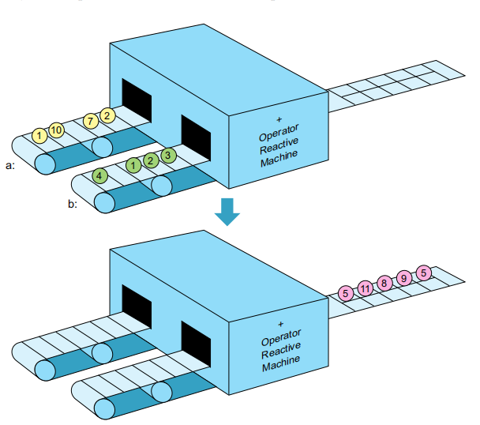
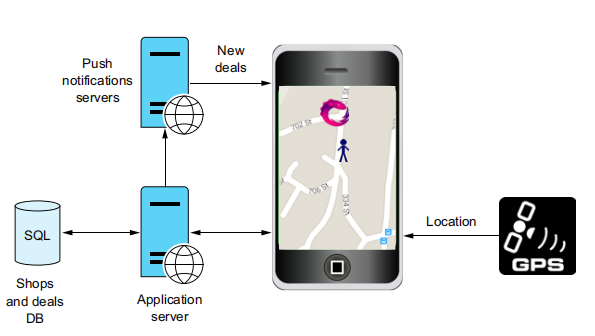
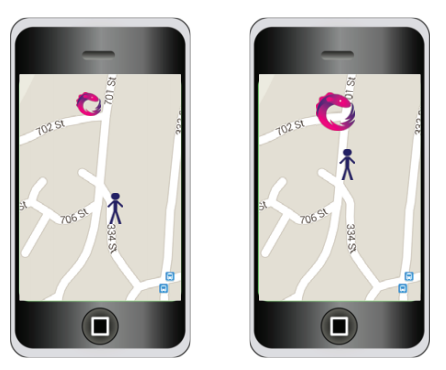
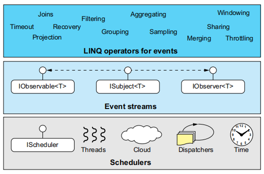
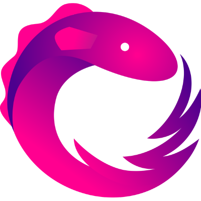
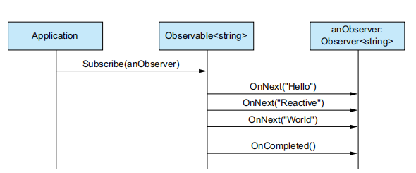
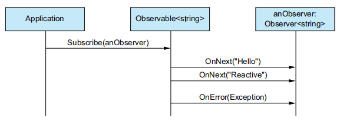
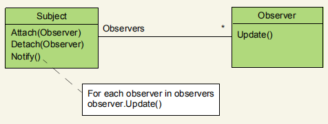

# 反应式编程

**本章涵盖**

- 开始 Reactive
- 将 events 看做 streams
- Reactive Extensions (Rx) 简介

作为一种旨在简化事件驱动的应用程序的实现和异步代码的执行的模型，近年来，Reactive 编程范式已越来越流行。 Reactive 编程专注于变化的传播及其影响，简单来说就是如何应对变化并创建依赖于它们的数据流。

随着诸如 Facebook 和 Twitter 之类的应用程序的兴起，在海洋的一侧发生的每一个变化（例如，状态更新）都会立即在另一侧被观察到，并且一系列的反应会在应用程序内部立即发生。 需要一个简化的模型来表达此反应链，这不足为奇。 如今，现代应用受到外部环境变化（例如GPS位置，电池和电源管理以及社交网络消息）以及应用内部变化（例如 Web 电话响应，文件读写，计时器）。对于所有这些事件，应用程序都做出了相应的反应，例如，通过更改显示的视图或修改存储的数据。

我们认为有必要简化模型来对多种类型的应用程序中的事件做出反应：机器人技术，移动应用程序，医疗保健等。以经典的命令性方式对事件做出反应会导致代码繁琐，难以理解且容易出错，可怜的程序员做一些修改时，不可避免地影响别的逻辑。这些更改可能会以不可预测的顺序发生，甚至可能同时发生。Reactive 编程为事件和随时间变化的状态提供了抽象，以便当我们创建在事件发生时运行的执行链时，我们可以摆脱管理这些值之间的依赖关系的麻烦。

Reactive Extensions（Rx）是一个库，为 .NET 应用程序提供了 Reactive 编程模型。 Rx 通过使用声明性操作（采用 LINQ 样式）在单个事件序列上创建查询，使事件处理代码更简单，更具表现力。Rx还提供了称为组合器（组合操作）的方法，这些方法使您能够加入事件序列，以便处理事件发生的模式或事件之间的相关性。 在撰写本文时，Rx 库中有600多个操作（算上重载方法）。 每个代码都封装了重复发生的事件处理代码，否则您将不得不编写自己的代码。

本书的目的是教您为什么应该采用 Reactive 编程的思维方式，以及如何使用 Rx 轻松，最主要的是愉悦的来构建事件驱动的应用程序。这本书将逐步教您有关 Rx 所基于的各个层面的信息，其中包括使您能够创建 Reactive 的基础知识。数据和事件流，通过 Rx 提供的丰富查询功能以及 Rx 并发模型，该模型允许您控制代码的异步性和响应处理程序的处理。 但是首先，您需要了解什么是 Reactive，以及传统命令式编程与事件处理方式之间的区别。

## 1.1 开始 Reactive

当应用程序发生更改时，您的代码需要对此做出反应；这就是 Reactive 的意思。变化有多种形式。 最简单的方法就是更改我们在日常编程中非常习惯的变量值。该变量包含一个值，该值可以在特定时间通过某个操作进行更改。例如，在C＃中，您可以编写如下代码：

```cs
int a = 2;
int b = 3;
int c = a + b;
Console.WriteLine("before: the value of c is {0}", c);
a=7;
b=2;
Console.WriteLine("after: the value of c is {0}", c);
```

输出：

```
before: the value of c is 5
after: the value of c is 5
```

在这个小程序中，两个打印输 c 变量显示相同的值。 在命令式编程模型中，c 的值为 5，除非您显式覆盖它，否则它将保持为 5。

有时您希望在 a 或 b 更改时更新 c。 响应式编程引入了随时间变化的另一种类型的变量：该变量并不一定为其赋值，而是通过对随时间变化的变化做出反应而改变。

再看一下我们的小程序； 在响应式编程模型中运行时，输出为：

```
before: the value of c is 5
after: the value of c is 9
```

“神奇”地改变了 c 的值。 这是由于其依赖项发生了更改。 此过程的工作原理就像一台机器由两个平行的输送机供料，并从任一侧的输入生成物品一样，如图 1.1 所示。



_函数 `c = a + b` 的反应表示。 随着 a 和 b 的值变化，c 的值也变化。 当 a 为 7 且 b 为 2 时，c 自动更改为 9。当 b 更改为 1 时，c 变为 8，因为 a 的值仍为 7。_

您可能会感到惊讶，但是您可能已经使用了响应式应用程序多年。响应性的概念使您最喜欢的电子表格应用程序变得如此易于使用和有趣。当您在电子表格单元格中创建此类方程式时，每次更改输入方程式的单元格中的值时，最终单元格会自动更改。

### 1.1.1 在应用程序中的响应性

在实际的应用程序中，您可以在许多情况下发现可能的时时变化的变量，例如 GPS 位置，温度，鼠标坐标，甚至是文本框内容。这些值都具有随时间变化的特性，应用程序会对这些值做出反应，因此它们是随时间变化的。还值得一提的是时间本身是一个时变；它的值一直在变化。在 C＃ 这样的命令式编程模型中，您将使用事件来创建对变化做出反应的机制，但是由于事件分散在各个代码片段中，因此可能导致代码难以维护。

想象一下一个移动应用程序，它可以帮助用户在其周边地区的商店中找到折扣和特价。我们称之为 Shoppy。 图1.2描述了 Shoppy 架构。



_图 1.2 Shoppy 应用程序体系结构。移动应用程序从 GPS 接收当前位置，并可以通过应用程序服务查询有关商店和交易的信息。当有新交易可用时，应用程序服务通过推送通知服务器发送推送通知。_

您想从 Shoppy 获得的一个很棒的功能之一就是，随着用户距离（从某个最小半径开始）越来越近，使商店图标的大小在地图上变大，如图 1.3 所示。 您还希望系统在更新时将新交易推送到应用程序可用。



_图 1.3 Shoppy 应用程序的地图视图。当用户离 Rx 商店很远时，图标变小（在左侧），而当用户靠近时，图标变大（在右侧）。_

在这种情况下，您可以说 `store.Location`， `myLocation` 和 `iconSize` 变量是时变的。 对于每个商店，图标大小可以写成：

```cs
distance = store.Location – myLocation;
iconSize = (MINIMAL_RADIUS / distance) * MinIconSize
```

由于您使用的是时变变量，因此每次 `myLocation` 变量发生变化时，距离变量都会触发变化。 最终，应用程序将通过使商店图标显得更大或更小做出反应，具体取决于与商店的距离。 请注意，为简单起见，我没有处理允许的最小图标尺寸的边界检查，该距离可能为 0 或接近它。

这是一个简单的示例，但是正如您将看到的那样，使用响应式编程模型的强大功能在于其合并和联接，以及对每个时变变量所推的值作为流进行分区和分割的能力。这是因为响应式编程使您可以专注于要实现的目标，而不是使其工作的技术细节。这导致简单易读的代码，并且消除了大多数样板代码（例如更改跟踪或状态管理），这些代码会使您从代码逻辑的意图中分心。当代码简短而集中时，它的 bug 更少，更易于掌握。

现在，我们可以从理论上停止讨论，以便您可以了解如何借助 Rx 在 .NET 中将响应式编程付诸实践。

## 1.2 引入 Reactive Extensions

既然我们已经介绍了响应式编程，那么现在是时候了解我们的明星了：Reactive Extensions，通常简称为 Rx。Microsoft 开发了 Reactive Extensions 库，以使其易于处理事件和数据流。从某种意义上说，时变值本身就是事件流。每次值的更改，都会触发您订阅事件，它会更新依赖于此事件的值。

Rx 通过将事件流抽象为可观察的序列来促进处理事件流，这也是 Rx 表示时变值的方式。可观察意味着您作为用户可以观察序列携带的值，而序列则意味着对所携带的物品存在顺序。Rx 由 Erik Meijer 和 Brian Beckman 设计，并从函数式编程风格中汲取了灵感。在 Rx 中，流由可观察对象表示，可观察对象可以从 .NET 事件，任务或集合创建，也可以由您自己从其他来源创建。使用 Rx，您可以使用 LINQ 运算符查询可观察对象，并使用调度程序控制并发性。这就是为什么 Rx 在 Rx.NET 源代码中经常被定义为 Rx = Observables + LINQ + Scheduler。Rx.NET 的各层如图 1.4 所示。



_图 1.4 Rx 分层。 中间是代表事件流的关键接口，最下面是控制流处理的并发性的调度程序。最重要的是强大的运算符库，使您可以创建 LINQ 风格的事件处理管道。_

在本书中，您将探索 Rx 图层的每个组成部分以及它们之间的相互作用，但是首先让我们看一下 Rx 起源的简短历史。

### 1.2.1 Rx 的历史

我认为，要完全控制某些东西（尤其是技术），您应该了解历史和幕后的细节。让我们从带有电鳗的Rx徽标开始，如图 1.5 所示；这条鳗鱼是Microsoft Live Labs 的 Volta 项目徽标。



_图 1.5 Rx 电鳗 logo，灵感来自 Volta 项目_

Volta 项目是一个实验性开发人员工具集，用于在正式定义云这个术语之前为云创建多层应用程序。 使用 Volta，您可以指定应用程序的哪些部分需要在云（服务器）中运行，哪些部分需要在客户端（桌面，JavaScript 或 Silverlight ）运行，而 Volta 编译器将为您完成艰苦的工作。 很快，很明显在将服务器产生的事件传输到客户端方面存在差距。由于 .NET 事件不是一等公民，因此无法序列化并推送给客户端，因此形成了可观察者和观察者对（尽管当时并没有这样）。

Rx 并不是 Volta 项目中唯一的技术。 还发明了JavaScript 编译器的中间语言（IL），它是Microsoft TypeScript 的起源。 在 Volta 上工作的同一支团队就是将 Rx 变为现实的一支。

自 2010 年发布以来，Rx 就是一个成功的故事，已被许多公司采用。在 .NET 之外的其他社区中也看到了它的成功，并且很快将其移植到其他语言和技术中。例如，Netflix 在其服务层中广泛使用 Rx，并负责 RxJava 端口。微软还内部使用 Rx 来运行 Cortana，Cortana 是每台 Windows Phone 设备中托管的智能个人助手；创建事件时，将在后台创建一个可观察对象。

在撰写本文时，Rx 支持 10 多种语言，包括 JavaScript，C++，Python 和 Swift。 Reactive Extensions 现在是开放源代码项目的集合。 您可以在 http://reactivex.io/ 上找到有关它们的信息以及文档和新闻。.NET的 Reactive Extensions 托管在GitHub存储库中，网址为 https://github.com/Reactive-Extensions/Rx.NET 。

现在，我们已经介绍了一些历史并有幸来讲述了这一点，让我们开始探索 Rx 的内部。

### 1.2.2 Rx 在客户端和服务端

Rx 非常适合事件驱动的应用程序。这是有道理的，因为事件（如前所述）是创建时变值的必要方法。从历史上看，由于用户交互被实现为事件，因此事件驱动的编程主要出现在客户端技术中。例如，您可能使用过 OnMouseMove 或 OnKeyPressed 事件。因此，您会发现许多使用Rx的客户端应用程序也就不足为奇了。 此外，某些客户端框架基于 Rx，例如 ReactiveUI（[http://reactiveui.net](http://reactiveui.net)）。

但是，请允许我向您保证，Rx 不是仅客户端技术。相反，对于 Rx 完全适合的服务器端代码，存在许多方案。此外，正如我之前所说，Rx 用于大型应用程序，例如 Microsoft Cortana，Netflix 和使用M icrosoft StreamInsight 的复杂事件处理（CEP）。 Rx 是一个出色的库，用于处理应用程序收到的消息，无论它是在服务层还是客户端层上运行都无关紧要。

### 1.2.3 Observables

可观察（Observables）变量用于在Rx中实现时变值（我们将其定义为可观察序列）。它们代表推送模型（push model），在该模型中，新数据被推送（或通知）观察者。

可观察值定义为事件（或通知）的来源，或者，如果您愿意，可以定义为数据流的发布者。 push model 意味着无需让观察者从源中获取数据并始终检查是否有尚未获取的新数据（拉模型 pull model），而是在数据可用时将其传递给观察者。

自 .NET Framework 4.0 版以来，可观察对象实现了 `IObservable<T>` 接口，该接口已驻留在System 命名空间中。

**清单 1.1** IObservable 接口

```cs
public interface IObservable<T>
{
    // 让观察者订阅可观察的序列
    IDisposable Subscribe(IObserver<T> observer); 
}
```

`IObservable<T>` 接口只有一个方法“Subscribe”，该方法允许观察者订阅通知。 Subscribe 方法返回一个 IDisposable 对象，该对象表示预订，并允许观察者随时通过调用 Dispose 方法取消预订。 可观察者持有已订阅观察者的集合，并在有必要通知时通知他们。这是使用 `IObserver<T>` 接口完成的，该接口从 .NET Framework 4.0 版开始也位于 System 命名空间中，如此处所示。

**清单 1.2** IObserver 接口

```cs
public interface IObserver<T>
{
    // 以可观察的顺序通知观察者一个新元素
    void OnNext(T value);
    // 通知观察者发生异常
    void OnError(Exception error);
    // 通知观察者可观察的序列已完成，不再发出任何通知。
    void OnCompleted();
}
```

使用 IObservable 和 IObserver 的基本流程如图 1.6 所示。 可观察的数据并不总是完整的； 它们可以是可能无限数量的已排序元素（例如，无限集合）的提供者。 可观察对象也可以是“安静的”，这意味着它永远不会推动任何元素，将来也不会。 观察者也可能失败； 失败可能发生在可观察对象已经推送元素之后，也可能发生在没有推送任何元素的情况下。

该可观测代数在以下表达式中正式化（其中 `*` 表示零次或多次，`?` 表示零次或一次，`|` 是 OR 运算符）

```math
OnNext(t)* (OnCompleted() | OnError(e))?
```



_图 1.6 交互的可观察和观察者流的 happy path 的顺序图。 在这种情况下，观察者被应用程序订阅了可观察者。 观察者将三则消息“推送”给观察者（在这种情况下只有一个），然后通知观察者消息已完成。_

失败时，将使用 OnError 方法通知观察者，并将异常对象传递给观察者以进行检查和处理（参见图 1.7 ）。 在发生错误之后（以及完成之后），不会再有更多消息发送给观察者。 当观察者不提供错误处理程序时，Rx 使用的默认策略是上报异常并导致崩溃。 您将在第 10 章中了解如何妥善处理错误的方法。



_图 1.7 观察到错误，将通过OnError方法将失败的异常对象通知给观察者。_


> **观察者设计模式**
>
> 在某些编程语言中，事件有时以一等公民的身份提供，这意味着您可以使用语言提供的关键字和类型定义和注册事件，甚至可以将事件作为参数传递给函数。
>
> 对于不支持事件作为一等公民的语言，观察者模式是一种有用的设计模式，可让您向应用程序添加类似事件的支持。 此外，.NET 的事件实现基于此模式。
>
> 观察者模式由“四人帮”（GoF）在“Design Patterns: Elements of Reusable Object-Oriented Software ”（Addison-Wesley Professional，1994）中引入。 该模式定义了两个部分：主题和观察者（不要与 Rx 的 IObserver 混淆）。 观察者是对事件感兴趣的参与者，并订阅引发事件的主题。 这是在统一建模语言（UML）类图：
>
> 

观察者模式很有用，但存在一些问题。 观察者只有一种方法可以接受事件。 如果要附加到一个以上的主题或一个以上的事件，则需要实现更多的更新方法。 另一个问题是，模式没有指定处理错误的最佳方法，而开发人员则需要找到一种方法来通知错误（如果有的话）。 最后但并非最不重要的一点是如何知道何时完成主题的问题，这意味着将不再有通知，这对于正确的资源管理可能至关重要。 Rx IObservable 和IObserver 基于 Observer 设计模式，但对其进行了扩展以解决这些缺点。

### 1.2.4 Operators