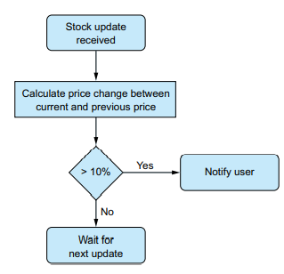

# 你好，Rx

**本章涵盖**

- 不适用 Rx
- 将 Rx 添加到项目中
- 创建你的第一个 Rx 应用程序

Rx 的目标是协调和编排来自各种来源（例如社交网络、传感器、UI 事件等）的基于事件的和异步计算。例如，建筑物周围的安全摄像头，以及当有人可能靠近建筑物时触发的运动传感器，从最近的摄像头向我们发送照片。 Rx 还可以计算包含选举候选人姓名的推文，以估计候选人的受欢迎程度。这是通过以异步方式调用外部 Web 服务来完成的。对于这些场景和其他类似场景，编排往往会导致复杂的程序，Rx 肯定会减轻这种工作，你马上就会看到。

在本章中，您将通过一个示例来了解使用和不使用 Rx 对应用程序的结构、可读性以及扩展和演化的容易程度有何不同。想象一下，您收到 Stocks R Us 公司著名的首席技术官 Penny 先生的一封信。Stocks R Us 是一家股票交易公司，为客户提供投资建议并从收益中收取利息。这就是为什么公司对股票市场的变化做出快速反应很重要的原因。最近，Stocks R Us 发现它可以通过使用一个系统来节省资金，该系统可以提供有关经历（Penny 先生称之为）剧烈变化的股票的警报。 Penny 先生对剧烈变化的定义是价格变化超过 10%。当这些变化发生时，Stocks R Us 想尽快知道，以便通过卖出或买入股票做出反应。

Penny 先生来找您是因为他知道，您可以快速交付高质量的应用程序。您的工作（以及本章的目标）是创建一个应用程序，通知用户股票经历了剧烈的变化。当股票价值在两次读数之间增加或减少某个阈值（在这种情况下为 10%）时，就会发生剧烈变化。发生这种情况时，您希望通过向用户的手机发送通知或在应用程序屏幕上显示警报（例如显示红色闪烁条）来通知用户。

在本章的第一部分，您将探索使用传统 .NET 事件方法创建应用程序时通常会发生的步骤。然后我们将分析解决方案并讨论其弱点。

本章的第二部分将 Rx 引入您的应用程序。您将首先将库添加到项目中，然后逐步制作 Rx 风格的 Stocks R Us 应用程序。

## 2.1 使用传统的 .NET 事件

股票信息来自股票交易来源，许多服务都提供此信息。每个都有自己的 API 和数据格式，其中一些来源是免费的，例如 Yahoo Finance (http://finance.yahoo.com) 和 Google Finance (www.google.com/finance)。 于您的应用程序，最重要的属性是股票的报价符号和价格。股票的报价符号是一系列唯一标识交易股票或股票的字符（例如，MSFT 是 Microsoft 股票代码）。

图 2.1 中的流程图描述了应用程序的逻辑流程。



_图 2.1 Stock R Us 应用程序逻辑的流程图。我们会通知用户发生剧烈变化——价格变化超过 10%。_

对于应用程序收到的每条股票信息，它计算股票的价格差异作为新价格和先前价格之间的变化比率。假设您收到一条更新，说明 MSFT 的价格已从 50 美元变为 40 美元，变动幅度为 20%。这被认为是一个剧烈的变化，并导致应用程序中显示警报。

在现实生活中，滴答声以可变速率到达。现在，为了避免让您感到困惑，您可以假设刻度以恒定速率到达；你稍后会处理时间方面。

为了保持股票信息的来源抽象，它通过类 StockTicker 公开。 该类仅公开有关 StockTick 的事件，每次有关股票的新信息可用时都会引发该事件

清单 2.1 StockTicker class

```cs
class StockTicker
{
    public event EventHandler<StockTick> StockTick;
}
```

StockTick 类保存有关股票的信息，例如其报价符号和价格。

清单 2.2 StockTick class

```cs
class StockTick
{
    public string QuoteSymbol { get; set; }
    public string Price { get; set; }
}
```

您通常会在这些类型的场景中看到传统的 .NET 事件。当需要向应用程序提供通知时，.NET 事件是将数据传送到应用程序的标准方式。要处理股票报价，您将创建一个 StockMonitor 类，该类将通过 += 运算符连接到 StockTick 事件来监听股票变化。

清单 2.3 StockMonitor class

```cs
class StockMonitor
{
    public StockMonitor(StockTicker ticker)
    {
        ticker.StockTick += OnStockTick;
    }
    // ...
}
```

该示例的核心在 OnStockTick 方法中。如果您已经有了之前的报价，您将在此处检查每个股票的报价，以便您可以将新价格与旧价格进行比较。为此，您需要一个容器来保存有关先前报价的所有信息。 因为每个价格变动都包含 QuoteSymbol，所以使用字典来保存该信息是有意义的，其中 QuoteSymbol 作为键。 为了保存有关先前报价的信息，您定义了一个名为 StockInfo 的新类（清单 2.4），然后您可以在 StockMonitor 类（清单 2.5）中声明字典成员。

清单 2.4 StockInfo class

```cs
class StockInfo
{
    public StockInfo(string symbol, decimal price)
    {
        ticker.StockTick += OnStockTick;
    }
    public string Symbol { get; set; }
    public decimal PrevPrice { get; set; }
}
```

每次使用新的价格变动调用 OnStockTick 时，应用程序都需要检查旧价格是否已保存到字典中。如果您要查找的键存在于字典中，则使用 TryGetValue 方法返回 true，然后使用存储在该键下的值设置 out 参数。

清单 2.5 OnStockTick 事件处理程序 检查股票是否存在

```cs
Dictionary<string, StockInfo> _stockInfos = new Dictionary<string, StockInfo>();

void OnStockTick(object sender, StockTick stockTick)
{
    StockInfo stockInfo;
    var quoteSymbol = stockTick.QuoteSymbol;
    var stockInfoExists = _stockInfos.TryGetValue(quoteSymbol, out stockInfo);
    ...
}
```

如果股票信息存在，您可以检查股票的当前和以前的价格，如下面的清单所示，以查看变化是否大于定义剧烈变化的阈值。

清单 2.6 OnStockTick 事件处理程序 处理价格变化

```cs
const decimal = MaxChangeRatio = .1m;
...
var quoteSymbol = stockInfo.QuoteSymbol;
var stockInfoExists = _stockInfos.TryGetValue(quoteSymbol, out stockInfo);
if (stockInfoExists)
{
    var priceDiff = stockTick.Price - stockInfo.PrevPrice;
    var changeRatio = Math.Abs(priceDiff / stockInfo.PrevPrice);
    if (changeRatio > MaxChangeRatio)
    {
        Console.WriteLine($"Stock: {quoteSymbol} has changed with {changeRatio} ratio, Old Price: {stockInfo.PrevPrice} New Price: {stockTick.Price}")
    }
    stockInfo.PrevPrice = stockTick.Price;
}
```

如果股票信息不在字典中（因为这是你第一次得到它），你需要将它添加到字典中。

```cs
_stockInfos[quoteSymbol] = new StockInfo(quoteSymbol,stockTick.Price);
```

当不再需要更新时（例如，当用户决定停止接收通知或关闭页面时），您需要使用 -= 操作符从事件中注销。但是你应该在哪里做呢？ 一种选择是在 StockMonitor 类中创建一个方法，您可以在想要停止时调用该方法。 但幸运的是，.NET 通过实现 IDisposable 接口提供了一种处理此类“清理”的机制，该接口包括用于释放资源的单个方法 Dispose。 这是它在 StockMonitor 中的样子：

```cs
public void Dispose()
{
    _ticker.StockTick -= OnStockTick; 
    _stockInfos.Clear();
}
```

完整代码如清单 2.7 所示。 我在以下系列上运行它：

```
Symbol: "MSFT" Price: 100
Symbol: "INTC" Price: 150
Symbol: "MSFT" Price: 170
Symbol: "MSFT" Price: 195
```

我得到了这些结果：

```
Stock:MSFT has changed with 0.7 ratio, Old Price:100 New Price:170
Stock:MSFT has changed with 0.15 ratio, Old Price:170 New Price:195.5
```

清单 2.7 StockMonitor 完整代码

```cs
class StockMonitor : IDisposable
{
    private readonly StockTicker _ticker;
    Dictionary<string, StockInfo> _stockInfos = new Dictionary<string, StockInfo>();
    public StockMonitor(StockTicker ticker)
    {
        _ticker = ticker; 
        ticker.StockTick += OnStockTick;
    }
    void OnStockTick(object sender, StockTick stockTick)
    {
    const decimal = MaxChangeRatio = .1m;
    StockInfo stockInfo;
    var quoteSymbol = stockInfo.QuoteSymbol;
    var stockInfoExists = _stockInfos.TryGetValue(quoteSymbol, out stockInfo);
    if (stockInfoExists)
    {
        var priceDiff = stockTick.Price - stockInfo.PrevPrice;
        var changeRatio = Math.Abs(priceDiff / stockInfo.PrevPrice);
        if (changeRatio > MaxChangeRatio)
        {
            Console.WriteLine($"Stock: {quoteSymbol} has changed with {changeRatio} ratio, Old Price: {stockInfo.PrevPrice} New Price: {stockTick.Price}")
        }
        stockInfo.PrevPrice = stockTick.Price;
    }
    else
    {
        _stockInfos[quoteSymbol] = new StockInfo(quoteSymbol,stockTick.Price);
    }

    public void Dispose()
    {
        _ticker.StockTick -= OnStockTick; 
        _stockInfos.Clear();
    }
}
```

===32