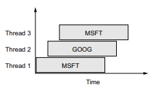
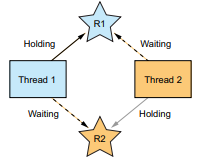
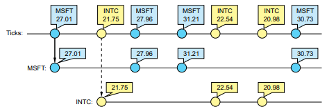
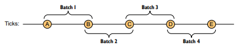
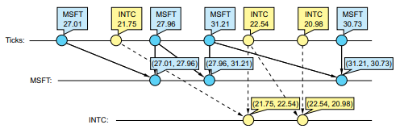
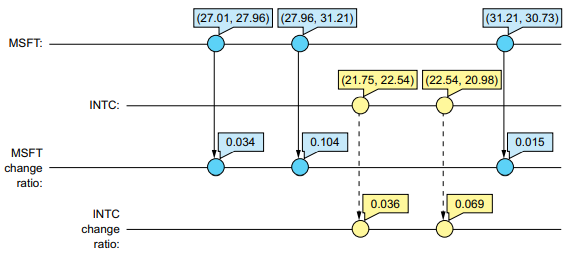
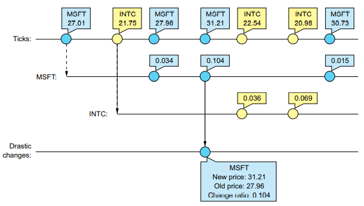

# 你好，Rx

**本章涵盖**

- 不适用 Rx
- 将 Rx 添加到项目中
- 创建你的第一个 Rx 应用程序

Rx 的目标是协调和编排来自各种来源（例如社交网络、传感器、UI 事件等）的基于事件的和异步计算。例如，建筑物周围的安全摄像头，以及当有人可能靠近建筑物时触发的运动传感器，从最近的摄像头向我们发送照片。 Rx 还可以计算包含选举候选人姓名的推文，以估计候选人的受欢迎程度。这是通过以异步方式调用外部 Web 服务来完成的。对于这些场景和其他类似场景，编排往往会导致复杂的程序，Rx 肯定会减轻这种工作，你马上就会看到。

在本章中，您将通过一个示例来了解使用和不使用 Rx 对应用程序的结构、可读性以及扩展和演化的容易程度有何不同。想象一下，您收到 Stocks R Us 公司著名的首席技术官 Penny 先生的一封信。Stocks R Us 是一家股票交易公司，为客户提供投资建议并从收益中收取利息。这就是为什么公司对股票市场的变化做出快速反应很重要的原因。最近，Stocks R Us 发现它可以通过使用一个系统来节省资金，该系统可以提供有关经历（Penny 先生称之为）剧烈变化的股票的警报。 Penny 先生对剧烈变化的定义是价格变化超过 10%。当这些变化发生时，Stocks R Us 想尽快知道，以便通过卖出或买入股票做出反应。

Penny 先生来找您是因为他知道，您可以快速交付高质量的应用程序。您的工作（以及本章的目标）是创建一个应用程序，通知用户股票经历了剧烈的变化。当股票价值在两次读数之间增加或减少某个阈值（在这种情况下为 10%）时，就会发生剧烈变化。发生这种情况时，您希望通过向用户的手机发送通知或在应用程序屏幕上显示警报（例如显示红色闪烁条）来通知用户。

在本章的第一部分，您将探索使用传统 .NET 事件方法创建应用程序时通常会发生的步骤。然后我们将分析解决方案并讨论其弱点。

本章的第二部分将 Rx 引入您的应用程序。您将首先将库添加到项目中，然后逐步制作 Rx 风格的 Stocks R Us 应用程序。

## 2.1 使用传统的 .NET 事件

股票信息来自股票交易来源，许多服务都提供此信息。每个都有自己的 API 和数据格式，其中一些来源是免费的，例如 Yahoo Finance (http://finance.yahoo.com) 和 Google Finance (www.google.com/finance)。 于您的应用程序，最重要的属性是股票的报价符号和价格。股票的报价符号是一系列唯一标识交易股票或股票的字符（例如，MSFT 是 Microsoft 股票代码）。

图 2.1 中的流程图描述了应用程序的逻辑流程。


_图 2.1 Stock R Us 应用程序逻辑的流程图。我们会通知用户发生剧烈变化——价格变化超过 10%。_

对于应用程序收到的每条股票信息，它计算股票的价格差异作为新价格和先前价格之间的变化比率。假设您收到一条更新，说明 MSFT 的价格已从 50 美元变为 40 美元，变动幅度为 20%。这被认为是一个剧烈的变化，并导致应用程序中显示警报。

在现实生活中，滴答声以可变速率到达。现在，为了避免让您感到困惑，您可以假设 StockTick 以恒定速率到达；你稍后会处理时间方面。

为了保持股票信息的来源抽象，它通过类 StockTicker 公开。 该类仅公开有关 StockTick 的事件，每次有关股票的新信息可用时都会引发该事件

清单 2.1 StockTicker class

```cs
class StockTicker
{
    public event EventHandler<StockTick> StockTick;
}
```

StockTick 类保存有关股票的信息，例如其报价符号和价格。

清单 2.2 StockTick class

```cs
class StockTick
{
    public string QuoteSymbol { get; set; }
    public string Price { get; set; }
}
```

您通常会在这些类型的场景中看到传统的 .NET 事件。当需要向应用程序提供通知时，.NET 事件是将数据传送到应用程序的标准方式。要处理股票报价，您将创建一个 StockMonitor 类，该类将通过 += 运算符连接到 StockTick 事件来监听股票变化。

清单 2.3 StockMonitor class

```cs
class StockMonitor
{
    public StockMonitor(StockTicker ticker)
    {
        ticker.StockTick += OnStockTick;
    }
    // ...
}
```

该示例的核心在 OnStockTick 方法中。如果您已经有了之前的报价，您将在此处检查每个股票的报价，以便您可以将新价格与旧价格进行比较。为此，您需要一个容器来保存有关先前报价的所有信息。 因为每个价格变动都包含 QuoteSymbol，所以使用字典来保存该信息是有意义的，其中 QuoteSymbol 作为键。 为了保存有关先前报价的信息，您定义了一个名为 StockInfo 的新类（清单 2.4），然后您可以在 StockMonitor 类（清单 2.5）中声明字典成员。

清单 2.4 StockInfo class

```cs
class StockInfo
{
    public StockInfo(string symbol, decimal price)
    {
        ticker.StockTick += OnStockTick;
    }
    public string Symbol { get; set; }
    public decimal PrevPrice { get; set; }
}
```

每次使用新的价格变动调用 OnStockTick 时，应用程序都需要检查旧价格是否已保存到字典中。如果您要查找的键存在于字典中，则使用 TryGetValue 方法返回 true，然后使用存储在该键下的值设置 out 参数。

清单 2.5 OnStockTick 事件处理程序 检查股票是否存在

```cs
Dictionary<string, StockInfo> _stockInfos = new Dictionary<string, StockInfo>();

void OnStockTick(object sender, StockTick stockTick)
{
    StockInfo stockInfo;
    var quoteSymbol = stockTick.QuoteSymbol;
    var stockInfoExists = _stockInfos.TryGetValue(quoteSymbol, out stockInfo);
    ...
}
```

如果股票信息存在，您可以检查股票的当前和以前的价格，如下面的清单所示，以查看变化是否大于定义剧烈变化的阈值。

清单 2.6 OnStockTick 事件处理程序 处理价格变化

```cs
const decimal = MaxChangeRatio = .1m;
...
var quoteSymbol = stockInfo.QuoteSymbol;
var stockInfoExists = _stockInfos.TryGetValue(quoteSymbol, out stockInfo);
if (stockInfoExists)
{
    var priceDiff = stockTick.Price - stockInfo.PrevPrice;
    var changeRatio = Math.Abs(priceDiff / stockInfo.PrevPrice);
    if (changeRatio > MaxChangeRatio)
    {
        Console.WriteLine($"Stock: {quoteSymbol} has changed with {changeRatio} ratio, Old Price: {stockInfo.PrevPrice} New Price: {stockTick.Price}")
    }
    stockInfo.PrevPrice = stockTick.Price;
}
```

如果股票信息不在字典中（因为这是你第一次得到它），你需要将它添加到字典中。

```cs
_stockInfos[quoteSymbol] = new StockInfo(quoteSymbol,stockTick.Price);
```

当不再需要更新时（例如，当用户决定停止接收通知或关闭页面时），您需要使用 -= 操作符从事件中注销。但是你应该在哪里做呢？ 一种选择是在 StockMonitor 类中创建一个方法，您可以在想要停止时调用该方法。 但幸运的是，.NET 通过实现 IDisposable 接口提供了一种处理此类“清理”的机制，该接口包括用于释放资源的单个方法 Dispose。 这是它在 StockMonitor 中的样子：

```cs
public void Dispose()
{
    _ticker.StockTick -= OnStockTick; 
    _stockInfos.Clear();
}
```

完整代码如清单 2.7 所示。 我在以下系列上运行它：

```
Symbol: "MSFT" Price: 100
Symbol: "INTC" Price: 150
Symbol: "MSFT" Price: 170
Symbol: "MSFT" Price: 195
```

我得到了这些结果：

```
Stock:MSFT has changed with 0.7 ratio, Old Price:100 New Price:170
Stock:MSFT has changed with 0.15 ratio, Old Price:170 New Price:195.5
```

清单 2.7 StockMonitor 完整代码

```cs
class StockMonitor : IDisposable
{
    private readonly StockTicker _ticker;
    Dictionary<string, StockInfo> _stockInfos = new Dictionary<string, StockInfo>();

    public StockMonitor(StockTicker ticker)
    {
        _ticker = ticker; 
        ticker.StockTick += OnStockTick;
    }

    void OnStockTick(object sender, StockTick stockTick)
    {
        const decimal = MaxChangeRatio = .1m;
        StockInfo stockInfo;
        var quoteSymbol = stockInfo.QuoteSymbol;
        var stockInfoExists = _stockInfos.TryGetValue(quoteSymbol, out stockInfo);
        if (stockInfoExists)
        {
            var priceDiff = stockTick.Price - stockInfo.PrevPrice;
            var changeRatio = Math.Abs(priceDiff / stockInfo.PrevPrice);
            if (changeRatio > MaxChangeRatio)
            {
                Console.WriteLine($"Stock: {quoteSymbol} has changed with {changeRatio} ratio, Old Price: {stockInfo.PrevPrice} New Price: {stockTick.Price}")
            }
            stockInfo.PrevPrice = stockTick.Price;
        }
        else
        {
            _stockInfos[quoteSymbol] = new StockInfo(quoteSymbol,stockTick.Price);
        }
    }

    public void Dispose()
    {
        _ticker.StockTick -= OnStockTick; 
        _stockInfos.Clear();
    }
}
```

Penny 先生很满意，Stock R Us 的员工正在使用该应用程序，效果已经在他们的报告中显示出来。应用程序接收股票更新，可以计算新旧价格之间的差异比率，并向用户发送警报。

就像生活中的一切事物一样，变化是不可避免的，Stocks R Us决定改变其股票信息来源。幸运的是，您使用 StockTicker 类抽象了源代码，因此 StockTicker 是唯一需要更改的类。

数据源更改后，您开始收到有关崩溃和其他错误的投诉，例如缺少警报或不必要的警报。于是你开始调查这个问题，发现它与并发有关。

### 2.1.1 处理并发

看起来可能并不明显，但代码隐藏了一个问题：并发。StockTicker 接口没有承诺 tick 事件将被哪个线程触发，并且也没有保证在您处理 StockMonitor 时另一个线程不会调用事件处理函数，如图 2.2 所示。



_图 2.2 多个线程同时执行事件处理程序代码。 每个框代表一只股票的执行时间。 当第一个线程运行 MSFT 代码时，第二个线程开始执行 GOOG 股票。 然后第三个线程开始使用与第一个线程相同的股票代码。_

您编写的 StockMonitor 类使用字典来保存有关股票的信息，但您使用的字典不是线程安全的。

---

**线程安全**

代码部分的线程安全意味着当从多个线程调用时，代码可以正常工作，无论这些线程执行代码的顺序如何，并且不需要线程同步。

如果一个类的任何一个方法是线程安全的，即使来自不同的线程中的不同方法同时调用，则该类被称为线程安全的。这通常意为着在同时修改数据时，内部数据结构被保护着。

---

您使用的字典确实支持同时读取，但是如果在修改字典时读取该字典，则会引发异常。 这种情况如表 2.1 所示。 Thread1（在左侧）进入标记的代码，在那里它尝试获取符号为 symbol1 的股票信息。同时，Thread2（右侧）将 symbol2 添加到字典。字典的读取和写入同时发生并导致异常。

表 2.1 读写发生在不同线程中

```cs
// Thread 1
var stockInfoExists = _stockInfos.TryGetValue(symbol1, out stockInfo);
^^^^^^^^^^^^^^^^^^^^^^^^^^^^^^^^^^^^^^^^^^^^^^^^^^^^^^^^^^^^^^^^^^^^^^
if (stockInfoExists)
{

}
else
{
    _stockInfos[symbol1] = new StockInfo(symbol1, price);
}

// Thread 2
var stockInfoExists = _stockInfos.TryGetValue(symbol2, out stockInfo);
if (stockInfoExists)
{

}
else
{
    _stockInfos[symbol2] = new StockInfo(symbol2, price);
    ^^^^^^^^^^^^^^^^^^^^^^^^^^^^^^^^^^^^^^^^^^^^^^^^^^^^^
}
```

您可以通过使用 .NET ConcurrentDictionary 来克服这个问题。这个无锁集合在内部同步读取器和写入器，因此不会抛出异常。

不幸的是，ConcurrentDictionary 还不够，因为 StockTicker 没有同步 ticks。 如果您同时处理同一只股票的两个（或更多）时，PrevPrice 属性的值是多少？这个问题有一个不确定的答案：最后一个获胜。但最后一个不一定“最后”一个，因为线程运行的顺序是由操作系统决定的，不是确定性的。这会使您的代码不可靠，因为您的代码得出的错误结论可能会通知给用户。OnStockTick 事件处理程序持有一个临界区，保护它的方法是使用锁。

清单 2.8 加锁版本的 OnStockTick

```cs
object _stockTickLocker = new object();
void OnStockTick(object sender, StockTick stockTick)
{
    const decimal = MaxChangeRatio = .1m;
    StockInfo stockInfo;
    var quoteSymbol = stockInfo.QuoteSymbol;
    lock (_stockTickLocker)
    {
        var stockInfoExists = _stockInfos.TryGetValue(quoteSymbol, out stockInfo);
        if (stockInfoExists)
        {
            var priceDiff = stockTick.Price - stockInfo.PrevPrice;
            var changeRatio = Math.Abs(priceDiff / stockInfo.PrevPrice);
            if (changeRatio > MaxChangeRatio)
            {
                Console.WriteLine($"Stock: {quoteSymbol} has changed with {changeRatio} ratio, Old Price: {stockInfo.PrevPrice} New Price: {stockTick.Price}")
            }
            stockInfo.PrevPrice = stockTick.Price;
        }
        else
        {
            _stockInfos[quoteSymbol] = new StockInfo(quoteSymbol,stockTick.Price);
        }
    }
}
```

在很多情况下，使用锁是一个完美的解决方案。 但是，当您开始在应用程序的不同位置添加锁时，最终可能会导致性能下降，因为锁会增加执行时间以及线程等待临界区可用的时间。更难的问题是锁会导致您的应用程序陷入死锁，如图 2.3 所示。 每个线程都持有另一个线程需要的资源，同时它们都在等待另一个线程持有的资源。



_图 2.3 死锁：线程 1 持有资源 R1 并等待资源 R2 可用。 同时，线程 2 持有资源 R2 并等待资源 R1。 如果没有外部干预发生，两个线程将永远保持锁定状态_

使用多线程应用程序很困难，并且不存在神奇的解决方案。 唯一合理的做法是使多线程运行的代码更容易理解，并尽量避免进入并发代码的“陷阱”。

Rx 提供了运行并发代码的操作符，你将在本章后面看到。 现在，让我们退后一步，看看你创造了什么，并分析它，看看你是否可以做得更好。

### 2.1.2 回顾解决方案并展望未来

到目前为止，我们的代码为 Penny 先生在本章开头描述的需求提供了解决方案。 在功能上，代码完成了它需要做的一切。 但你对此有何感受？ 它可读吗？ 它好维护？ 容易扩展吗？ 我想提醒你注意一些事情。

#### 代码散布（CODE SCATTERING）

让我们从代码的散布开始。 众所周知，分散的代码会使程序更难维护、审查和测试。 在我们的示例中，程序的主要逻辑位于离事件注册很“远”的 OnStockTick 事件处理程序中：

```cs
class StockMonitor : IDisposable
{
    public StockMonitor(StockTicker ticker)
    {
        // 注册事件
        ticker.StockTick += OnStockTick;
    }

    void OnStockTick(object sender, StockTick stockTick)
    {
        // 处理事件
    }

    public void Dispose()
    {
        // 取消注册和清理
    }
}
```

处理多个事件（甚至更多）的类很常见，每个类都在自己的事件处理程序中，您可能会开始忽略与以下内容相关的内容：

```cs
class SomeClass
{
    public SomeClass(StockTicker ticker)
    {
        // 注册事件
        eventSource.event1 += OnEvent1;
        eventSource.event2 += OnEvent2;
        eventSource.event3 += OnEvent3;
    }

    void OnEvent1(object sender, EventArgs args)
    {
        // 每个事件的事件处理程序；有可能多个事件处理程序对应一个事件。类中也会存在处理逻辑的方法，无论是否连接到事件。
        //...
    }

    void OnEvent2(object sender, EventArgs args)
    {
        // 每个事件的事件处理程序；有可能多个事件处理程序对应一个事件。类中也会存在处理逻辑的方法，无论是否连接到事件。
        //...
    }

    void OnEvent3(object sender, EventArgs args)
    {
        // 每个事件的事件处理程序；有可能多个事件处理程序对应一个事件。类中也会存在处理逻辑的方法，无论是否连接到事件。
        //...
    }

    public void Dispose()
    {
        // 取消注册和清理。 与事件没有关系。
    }
}
```

很多时候，开发人员选择将事件处理程序注册更改为 lambda 表达式，例如：

```cs
anObject.SomeEvent += (sender, args) => {...};
```

尽管您将事件处理程序逻辑移至注册，但怎么注销事件处理程序？ -= 运算符允许您注销事件处理程序，但是需要使用同一个委托。 一个 lambda 表达式只能按如下方式取消注册：

```cs
eventHandler = (sender, args) => {...};
anObject.SomeEvent += eventHandler;
anObject.SomeEvent -= eventHandler;
```

这看起来不干净，所以现在如果您需要取消注册，您需要将 eventHandler 保存为成员。

#### 资源处理

从事件注销以及为支持代码（例如字典）而添加的其余资源清理发生在 Dispose 方法中。这是一个很好用的模式，但开发人员经常忘记释放他们的代码使用的资源。尽管 C# 和 .NET 作为一个整体被管理并使用垃圾收集，但很多时候您仍然需要正确释放资源以避免内存泄漏和其他类型的错误。事件经常被注册，这是内存泄漏的主要原因之一。原因（至少对某些人而言）是，我们取消注册的方式对许多开发人员来说并不自然，并且决定取消注册的正确地点和时间并不总是那么简单——尤其是因为许多开发人员更喜欢使用 lambda 风格的注册事件，正如我之前所说的。除了事件本身，您还添加了代码和状态管理（例如我们的字典）来支持您的逻辑。更多类型的应用程序处理相同的场景，例如过滤、分组、缓冲，当然还有清理它们带来的东西。

#### 可重复性和可组合性

对我来说，我们的逻辑也可以重复。 我发誓我在过去的应用程序中编写了这段代码（或类似的代码），通过一个键保存以前的状态并在每次更新时更新它，我敢打赌你也有同样的感觉。 而且，我也觉得这段代码是不可组合的，你的条件越多，你看到的 if 语句就越内在，你的代码可读性就越差。 在应用程序中看到这种代码很常见，而且由于其箭头状结构，越来越难以理解和遵循它的作用：

```cs
if (some condition)
{
    if (another condition)
    {
        if (another inner condition)
        {
            // some code
        }
    }
}
else
{
    if (one more condition)
    {
        // some code
    }
    else
    {
        // some code
    }
}
```

---

**组合**

组合是从更简单的结构中组合出复杂结构的能力。

此定义类似于数学中的定义，在数学中您可以从一组其他函数组成一个复杂的表达式：f(x) = x² + sin(x)

组合还允许我们使用一个函数作为另一个函数的参数：

```
g(x) = x + 1;
f(g(x)) = (x + 1)² + sin(x + 1)
```

在计算机科学中，我们使用组合来表达具有更简单功能的复杂代码。 这让我们可以做更高的抽象，专注于代码的目的，而不是细节，更容易掌握。

---

如果对您的代码提出了新要求，例如通过查看两个以上的连续事件来计算变化率，您的代码将不得不发生巨大的变化。 如果新需求是基于时间的，例如查看时间间隔内的变化率，则变化会更加显着。

#### 同步

同步是开发人员容易忘记的另一件事，这会导致我们遇到的相同问题：由于值计算不当导致代码不可靠，以及在使用非线程安全类时可能发生的崩溃。同步就是确保如果多个线程同时访问相同的代码（实际上，不一定是并行的，因为可能涉及上下文切换），那么只有一个线程可以访问。 锁是实现同步的一种方式，但存在其他方式并且确实需要知识和关注。

编写非线程安全的代码很容易，但编写带有导致死锁或饥饿锁的代码就更容易了。 这些类型的错误的主要问题是它们很难被找到。 您的代码可能会运行很长时间（字面意思），直到您遇到崩溃或其他错误。

这么小的程序有这么多要点，难怪有人说编程难。 是时候看看 Rx 的伟大之处，以及它是如何解决我们之前讨论的问题。 让我们看看 Rx 的方式并开始将 Rx 添加到您的应用程序中。

## 2.2 创建你的第一个 Rx 应用

在本节中，Rx 示例使用您在上一节中看到的相同 StockTicker，但这次您不会使用传统的标准 .NET 事件。 相反，您将使用将 IObservable<T> 创建，然后围绕它编写事件处理流。 您将慢慢地将一层又一层地添加到解决方案中，直到您拥有一个更易于阅读和扩展的完整可运行的应用程序。

每一段旅程都从第一步开始。 您将通过创建一个新项目（控制台应用程序即可）并添加 Rx 库来开始此旅程。

大多数情况下，您会将 System.Reactive 包添加到您的项目中，因为它包含最常用的类型。 当您编写特定平台或技术时，您将添加补充包。

## 2.3 编写事件处理流

将所需的 Rx 引用添加到项目后，您可以开始围绕它构建应用程序。 要开始创建事件处理流，您需要事件源。 在 Rx 中，事件源（如果您愿意，也可以叫它发布者）是实现 IObservable<T> 接口的对象。

概括地说，IObservable<T> 接口定义了单一方法 Subscribe，该方法允许观察者订阅通知。 Observers 实现了 IObserver 接口，该接口定义了在有通知时由 Observable 调用的方法。

Rx 提供了各种工具来将各种类型的源转换为 IObservable<T>，其中最基本的工具是将标准的 .NET 事件转换为可观察的。

在我们创建提供剧烈股票变动通知的应用程序的示例中，您将继续使用 StockTick 事件。 你会看到如何把它变成一个可以用来施展魔法的 Observable。

### 2.3.1 订阅事件

StockTicker 公开了每次股票发生更新时引发的事件 StockTick。 但是要使用 Rx，您需要将此事件转换为 Observable。 幸运的是，Rx 提供了 FromEventPattern 方法，使您能够做到这一点：

```cs
var ticker = new StockTicker();
IObservable<EventPattern<StockTick>> ticks = Observable.FromEventPattern<EventHandler<StockTick>, StockTick>(
    h => ticker.StockTick += h,  // 注册 Rx 事件处理
    h => ticker.StockTick -= h); // 注销 Rx 事件处理
```

清单 2.8 FromEventPattern 方法签名

```cs
IObservable<EventPattern<TEventArgs>> FromEventPattern<TDelegate, TEventArgs>(Action<TDelegate> addHandler, Action<TDelegate> removeHandler);
```

FromEventPattern 方法有几个重载。 在这里使用的是清单 2.8 中的一个重载。

addHandler 和 removeHandler 参数向事件注册和注销 Rx 处理程序；Rx 处理程序将被事件调用，然后将调用观察者的 OnNext 方法。

#### 解开事件参数

ticks 变量现在拥有一个类型为 IObservable<EventPattern<StockTick>> 的 Observable。 每次引发事件时，都会调用 Rx 处理程序并将事件参数和事件源包装到 EventPattern 类型的对象中，该对象将通过 OnNext 方法传递给观察者。 因为你只关心 StockTick（EventPattern 类型中的 EventArgs）的每个通知，您可以添加 Select 运算符，该运算符将转换通知并解开 EventArgs，以便只有 StockTick 将被推送到流中：

```cs
Observable.FromEventPattern<EventHandler<StockTick>, StockTick>(
    h => ticker.StockTick += h,
    h => ticker.StockTick -= h)
    .Select(tickEvent => tickEvent.EventArgs)
```

### 2.3.2 将股票通过符号分组

现在您有了一个带有 StockTick 的 Observable，您可以开始围绕它编写查询。 首先要做的是按它们的符号对 StockTick 进行分组，这样您就可以分别处理每组（股票）。 使用 Rx，这是一项简单的任务，如清单 2.9 所示。

清单 2.9 将股票通过符号分组

```cs
from tick in ticks
group tick by tick.QuoteSymbol into company
```

这个表达式创建了一个组的 Observable。 每个组代表一个公司，并且是一个可观察的对象，只会推动该组的 StockTick。 来自 StockTick 源的每个 Observable 通过其符号路由到正确的 Observable 组。 如图 2.10 所示。



_图 2.10 可观察的 StockTick 分为两组，每组对应一个不同的代码。 当通知被推送到可观察的 StockTick 上时，它们被路由到他们的可观察组。 如果是第一次出现该符号，则会为该组创建一个新的 Observable_

此分组是用查询表达式编写的。 查询表达式是用声明式查询语法编写的，但它是一种糖语法，编译器将其转换为真正的方法调用链。 这是用方法语法编写的相同表达式：

```cs
ticks.GroupBy(tick => tick.QuoteSymbol);
```

### 2.3.3 找出 StockTick 之间的差异

寻找任意剧烈变化的下一步是比较两个连续的 StockTick，看看它们之间的差异是否高于特定比率。 为此，您需要一种对组内的 StockTick 进行批处理的方法，以便将两个 StockTick 放在一起。 批处理应该以这样一种方式进行，即两个连续的批次将包含一个共享的 StockTick； 批次中的最后一个刻度将是下一个批次中的第一个刻度。 图 2.11 显示了这种批处理的示例。



_图 2.11_

要在可观察序列上创建批次，请使用 Buffer 运算符。 Buffer 获取您想要的批次中的项目数（在本例中为两个）以及在打开新批次之前要跳过的项目数作为参数。 在打开新批次之前，您需要跳过一项，从而在两个批次之间共享一项。 您需要通过编写以下内容将 Buffer 方法应用于每个组：

```cs
company.Buffer(2, 1)
```

Buffer 方法输出一个数组，其中包含两个连续的 StockTick，如图 2.12 所示。 这使您能够计算两个 StockTick 之间的差异，以查看它是否在允许的阈值内。



_图 2.12 在每个组上应用 Buffer(...) 方法后，您将获得一种新类型的通知，其中包含两个连续 StockTick 的数组。_

通过使用Let关键字，Rx允许您将计算保存在一个变量中，该变量将在可观测数据上进行：

```cs
from tick in ticks
group tick by tick.QuoteSymbol into company
from tickPair in company.Buffer(2, 1)
let changeRatio = Math.Abs((tickPair[1].Price - tickPair[0].Price) / tickPair[0].Price)
```

此代码片段包括您到目前为止的所有步骤。 对可观察的 company 应用缓冲会创建一个新的 Observable，它推送两个 StockTick 的数组。 您可以使用 from ... in ... 语句观察其通知。 每个通知
由 tickPair 变量表示。

然后引入 changeRatio 变量，该变量保存两个刻度之间的变化比率； 这个变量将被 Observable 带入你的查询的其余部分，如图 2.13 所示。



_图 2.13 通过每个公司组的每对 StockTick ，您可以计算差异比率。_

现在您知道了变化率，剩下的就是过滤掉所有不感兴趣的通知（不是剧烈的变化），并通过应用 Where(...) 运算符只保留那些高于您想要的比率的通知。

```cs
var drasticChanges =
    from tick in ticks
    group tick by tick.QuoteSymbol into company
    from tickPair in company.Buffer(2, 1)
    let changeRatio = Math.Abs((tickPair[1].Price - tickPair[0].Price) / tickPair[0].Price)
    where changeRatio > maxChangeRatio
    select new DrasticChange
    {
        Symbol = company.Key,
        ChangeRadio = changeRadio,
        OldPrice = tickPair[0].Price,
        NewPrice = tickPair[1].Price
    }
```

drasticChanges 变量是一个可观察的变量，它仅针对代表高于 maxChangeRatio 的股票价格变化的 StockTick 推送通知。 在图 2.14 中，最大变化率为 10%。



_图 2.14 使用 Where 运算符过滤通知后，您发现只有一个通知是剧烈变化的。_

要使用剧烈变化的通知，您需要订阅 drasticChange。 然后您可以通过将其打印到屏幕来通知用户。

```cs
_subscription = 
    drasticChanges.Subscribe(change =>
    {
        Console.WriteLine($"Stock: {change.Symbol} has changed with {change.ChangeRatio} ratio, Old Price: {change.OldPrice} New Price: {change.NewPrice}")
    }, ex =>
    {
        // 处理错误的代码
    }, () =>
    {
        // 处理观察完成后的代码
    })
```

### 2.3.4 清理资源

如果用户不想收到更多关于剧烈变化的通知时，你需要清理对 drasticChanges 的订阅。 当您订阅 Observable 时，订阅会返回给您，并且您将其存储在 _subscription 类成员中。

和以前一样，StockMonitor 的 Dispose 方法（因为您实现了 IDisposable 接口）非常适合。 在 Dispose 方法中唯一需要做的就是调用订阅对象的 Dispose 方法：

```cs
public void Dispose()
{
    _subscription.Dispose();
}
```

请注意，您无需编写任何有关查询处理中涉及的委托的内容，也无需清理任何与存储先前报价数据相关的数据结构。 所有这些都保存在 Rx 内部运算符实现中，当您清理订阅时，会发生一系列处理，导致所有内部数据结构也被处理。

### 2.3.5 处理并发

在传统事件版本中，您需要添加代码来处理应用程序中的临界区。 此临界区使两个线程能够同时到达事件处理程序并同时读取和修改您过去的 StockTick 集合，从而导致异常和更改率的错误计算。 您添加了一个锁来同步对临界区的访问，这是在线程之间提供同步的一种方式。

使用 Rx，向执行流添加同步更具声明性。 将同步（Synchronize）运算符添加到您要开始同步的位置，Rx 将负责其余的工作。 在这种情况下，您可以从头开始添加同步，因此您在创建 Observable 本身时添加同步（Synchronize）运算符：

```cs
Observable.FromEventPattern<EventHandler<StockTick>, StockTick>(
    h => ticker.StockTick += h,
    h => ticker.StockTick -= h)
    .Select(tickEvent => tickEvent.EventArgs)
    .Synchronize()
```

没有比这更简单的了，但和以前一样，您需要记住，每次添加任何类型的同步时，都有可能增加死锁的风险。 Rx 并没有解决这个问题，所以开发人员仍然需要谨慎。 Rx 只为您提供工具，使同步的引入更容易和更明显。 当事情变得简单、明确和可读时，你做对的机会就会增加，但作为一个开发人员，确保正确地完成它仍然是你需要做的。

### 2.3.6 刨析

清单 2.9 展示了 Rx 版本的完整代码。 与传统事件示例的主要区别在于，代码讲述了您要实现什么的故事，而不是您如何实现它。 这是 Rx 所基于的声明式编程模型。

清单 2.9 有锁版本的 OnStockTick

```cs
class RxStockMonitor : IDisposable
{
    private IDisposable _subscription;

    public RxStockMonitor(StockTicker ticker)
    {
        const decimal maxChangeRadio = 0.1m;
        var ticks = Observable.FromEventPattern<EventHandler<StockTick>, StockTick>(
            h => ticker.StockTick += h,
            h => ticker.StockTick -= h)
        .Select(tickEvent => tickEvent.EventArgs)
        .Synchronize();

        var drasticChanges =
            from tick in ticks
            group tick by tick.QuoteSymbol into company
            from tickPair in company.Buffer(2, 1)
            let changeRatio = Math.Abs((tickPair[1].Price - tickPair[0].Price) / tickPair[0].Price)
            where changeRatio > maxChangeRatio
            select new DrasticChange
            {
                Symbol = company.Key,
                ChangeRadio = changeRadio,
                OldPrice = tickPair[0].Price,
                NewPrice = tickPair[1].Price
            };

        _subscription = 
        drasticChanges.Subscribe(change =>
        {
            Console.WriteLine($"Stock: {change.Symbol} has changed with {change.ChangeRatio} ratio, Old Price: {change.OldPrice} New Price: {change.NewPrice}")
        }, ex =>
        {
            // 处理错误的代码
        }, () =>
        {
            // 处理观察完成后的代码
        });
    }

    public void Dispose() => _subscription.Dispose();
}
```

现在是比较 Rx 和事件版本的好时机。

#### 保持代码封闭

在 Rx 示例中，所有与查找剧烈变化的逻辑相关的代码都在同一个地方，从事件转换到 Observable 到在屏幕上显示通知的订阅。 所有这些都采用相同的方法，这使得在解决方案中导航变得更加容易。 这是一个小例子，即使所有的代码都放在一起，它并没有创建一个巨大的方法。 相比之下，传统事件版本将代码及其数据结构分散在类中。

#### 提供更好和更少的资源处理

Rx 版本几乎没有任何资源处理，而那些你想要释放的资源是通过调用 Dispose 显式释放的。 你不知道 Rx 管道创建的真实资源，因为它们被很好地封装在操作符的实现中。 您需要管理的资源越少，您的代码在管理资源方面就越好。 这与传统事件版本相反，在传统事件版本中，您需要添加所涉及的每个资源并且必须管理其生命周期，这使得代码容易出错。

#### 使用可组合运算符

最难的计算机科学问题之一是命名事物——方法、类等等。 但是，当您为某物取一个好名字时，它会使以后使用它的过程变得轻松流畅。 这正是您使用 Rx 运算符获得的结果。 Rx 运算符是一种重复的命名代码模式，它降低了代码的重复性，否则您必须自己编写——这意味着现在您可以编写更少的代码并重用现有代码。 在 Observable 上构建查询的每一步，都在之前构建的表达式上添加了一个新的运算符； 这是最好的可组合性。 可组合性使您可以轻松地在未来扩展查询并在构建时进行调整。 这与传统的事件版本相反，在传统的事件版本中，在构建整个过程以发现剧烈变化事件时，处理每个步骤的代码片段之间没有明确的分离。

#### 执行同步

Rx 有一些专门用于并发管理的操作符。 在这个例子中，你只使用了 Synchronize 操作符，正如之前关于 Rx 操作符的一般说明，它可以避免你自己错误地使用锁。 默认情况下，Rx 不会在线程之间执行任何同步——与常规事件相同。 但是当需要采取行动时，Rx 使开发人员添加同步变得简单，并省去了低级同步语法（lock）的使用，这使得代码更具吸引力。

## 2.4 总结

本章提供了一个简单但功能强大的示例，说明您过去可能已经做过（或者可能会发现自己将来会做的事情），并通过两种方式解决它：传统的事件风格和事件处理流程的 Rx 风格。

- 要使用 Rx 库，您需要安装 Rx 包。 大多数情况下你会安装 System.Reactive 包。
- 您可以在任何类型的应用程序中使用 Rx。例如：WPF、ASP.NET 或简单的控制台应用程序等。
- 传统的 .NET 事件可以转换为可观察的对象。
- Rx 允许您在 Observable 之上编写查询表达式。
- Rx 提供了许多查询运算符，例如使用 Where 运算符进行过滤、使用 Select 运算符进行转换等。

当然，这并不止于此。 这只是你旅程的开始。 要在您的应用程序中正确使用 Rx 并使用所有丰富的运算符，您需要了解它们以及将它们组合在一起的技术，这就是本书的全部内容。 在下一章中，您将了解函数式思维方式，以及 .NET 内部的核心概念，使 Rx 得以发展。